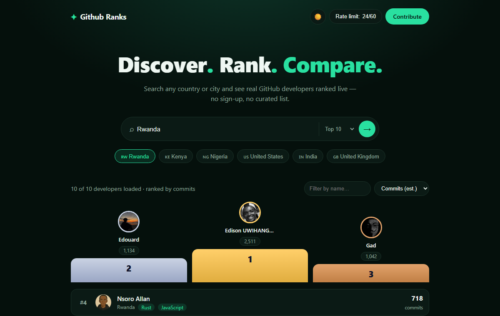

# Github ranks

**🔗 [Live demo](https://draken250.github.io/Github-ranks/)** — try the "Discover
developers by location" search in the sidebar (there's a Rwanda 🇷🇼 quick button) to
see it pull real, live-ranked GitHub developers for any country.

A simple, static leaderboard for GitHub developers — filterable by country, region,
city, and programming language. No backend, no build step, no curated list: type a
location and it searches GitHub live for real public profiles that match, then ranks
them by commits, stars, repos, or followers — all powered by the public GitHub API
straight from your browser.



**This project is open source.** See [Contributing](#contributing) below.

## Features

- 🔭 **Discover by location** — search GitHub live for up to 100 real developers in any
  country, region, or city (e.g. type "Rwanda")
- 🌍 Narrow results further by country → region/state → city
- 🧑‍💻 Filter by programming language (derived from each developer's public repos)
- 🔎 Search by name or username
- 📊 Sort by estimated commits, stars, public repos, or followers
- 🥇 Podium view for the top 3
- 🔑 Optional personal access token (stored only in your browser) to raise the
  GitHub API rate limit from 60/hour to 5,000/hour — recommended if you want a full
  "top 100" for a country, since that means ~100-200 API calls

## Try it

**[draken250.github.io/Github-ranks](https://draken250.github.io/Github-ranks/)** is
the live version, or run it locally via a local server:

```
npx serve .
# or
python -m http.server 8000
```

## How it works

- The "Discover by location" search calls GitHub's `search/users?q=location:<query>`
  endpoint to find up to 100 real public profiles matching a location, live.
- For each of those developers, `app.js` fetches their public profile and repos from
  the GitHub REST API directly from your browser (nothing goes through a server),
  aggregates languages and stars, and estimates a commit count via GitHub's commit
  search API.
- Results are cached in `localStorage` for 30 minutes to keep well within GitHub's
  rate limits.
- Everything renders client-side with vanilla HTML/CSS/JS — no framework, no build
  step, easy to fork and deploy on GitHub Pages.

## Contributing

Pull requests are very welcome. See [CONTRIBUTING.md](CONTRIBUTING.md) for how to
get set up — it takes no tooling beyond a text editor and (optionally) a local
static file server.

## License

[MIT](LICENSE)
